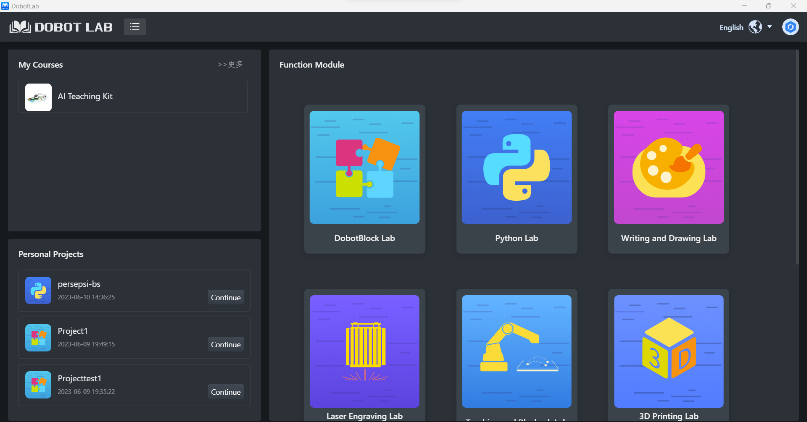
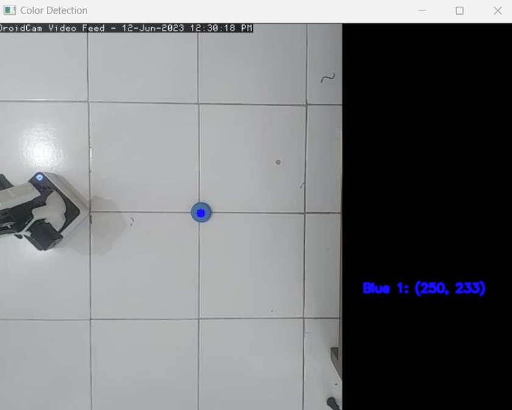

# Persepsi Robotika - Pick and Place dengan Dobot Magician
*Tujuan dari proyek ini adalah untuk mendeteksi lokasi suatu objek dan melakukan operasi pick-and-place. Dari perspektif implementasi, proyek ini membahas  Persepsi Robotika dengan OpenCV (Open-source Computer Vision Library).*

[DoBot Magician](https://www.dobot.cc/dobot-magician/product-overview.html) adalah sebuah robot lengan serbaguna yang dirancang untuk berbagai aplikasi. Robot ini dilengkapi dengan lengan robotik yang dapat bergerak dengan presisi tinggi dalam tiga sumbu. Selain itu, Dobot Magician juga memiliki kemampuan untuk mengganti end effector, seperti gripper (penggenggam) atau pen, sesuai dengan kebutuhan aplikasi. Fitur ini memungkinkan robot ini untuk melakukan berbagai tugas seperti pemindahan dan pengambilan objek, pemrograman robot, pencetakan 3D, dan pemrosesan otomatis dengan fleksibilitas yang tinggi.

[OpenCV (Open Source Computer Vision)](https://opencv.org/) adalah sebuah pustaka atau library kode sumber terbuka yang berfokus pada pengolahan citra dan penglihatan komputer. OpenCV menyediakan berbagai fungsi dan algoritma yang dapat digunakan untuk melakukan berbagai tugas seperti deteksi objek, pelacakan, segmentasi, analisis video, dan pengenalan pola. 

Dalam hal ini memfokuskan pengoperasian DoBot Magician melalui Python dengan  menggunakan [Dobot Lab](https://www.dobot-robots.com/products/education/magician.html). Menggunakan kode Python memberikan kebebasan yang lebih besar dalam mengontrol DoBot Magician, termasuk otomatisasi dan gerakan yang sangat terkalibrasi untuk tugas yang kompleks. 

## Daftar Isi
* [Memulai](#memulai)
* [Panduan](#panduan)
   * [Pengaturan Kamera](#Pengaturan-Kamera)
   * [Deteksi Objek dengan OpenCV](#Deteksi-Objek-dengan-OpenCV)
   * [Menghubungkan Robot](#Menghubungkan-Robot)
   * [Kalibrasi Robot dengan Kamera](#Kalibrasi-Robot-dengan-Kamera)
   * [Pick and Place](#Pick-and-Place)
* [Kode Akhir](#Kode-Akhir)


## Memulai

Untuk berkomunikasi dengan robot, kita memerlukan aplikasi [Dobot Lab](https://www.dobot-robots.com/products/education/magician.html). Selanjutnya pastikan kita juga menginstal 
[Python](https://www.python.org/) dan [OpenCV](https://opencv.org/) dalam lingkungan Python. Untuk IDE, kita dapat memanfaatkan menu Python Lab dalam aplikasi Dobot Lab.


## Panduan

Untuk memahami bagaimana alur kerja pick-and-place mari kita bagi menjadi tiga kategori berupa persepsi, kognisi, dan aksi. Persepsi merupakan bagaimana robot dapat melihat lingkungan sekitar. Secara default, Dobot Magician tidak memiliki sensor yang mengawasi kondisi eksternal robot. Oleh sebab itu, kita akan menggunakan kamera sebagai masukan citra yang terhubung ke komputer. Kognisi adalah bagaimana robot dapat memahami lingkungan sekitar. Kita melakukan pengolahan citra dengan menggunakan OpenCV dengan Python yang dapat melakukan berbagai operasi pengolahan citra, dalam projek ini berarti bagaimana objek dapat dideteksi berdasarkan klasifikasi warna. Aksi adalah pergerakan yang dilakukan robot setelah memahami lingkungan sekitar, dalam projek ini berarti bagaimana robot dapat bergerak dan mengambil objek.

## Pengaturan Kamera

Untuk kamera, kami menggunakan sistem kamera global dimana ada kamera diatas dobot yang berfungsi untuk melakukan tracking benda yang akan diambil oleh dobot. Dobot memmpunyai visual kit yang dapat dibeli jika anda tertarik. Namun kami melakukan DIY dengan menggunakan phonr holder di atas meja.


Berikut ini kode agar lengan robot bergerak pada titik kalibrasi. Selanjutnya kita letakkan objek referensi untuk kalibrasi dan mulai mencatat koordinat kamera dan robot dan kemudian lakukan analisis regresi di excel untuk mendapatkan rumus x dan y

**Syntax**:
```python
#kalibrasi
from DobotEDU import *
import time

x_move = [104.98, 93.61, 113.31, 200.36, 235.55, 285.53, 305.22, 303.47, 283.66, 233.05, 185.77, 109.29, 83.83, 64.08, 88.85]
y_move= [292.72, 249.02, 163.24, 217.29, 135.9, 60.74, 14.06, -59.98, -130.51, -166.11, -209.8, -268.17, -284.29, -219.94, -283.83]

for i in range (len(x_move)):
  magician.ptp(mode=0, x=x_move[i], y=y_move[i], z=-50, r=0)
  time.sleep(3)
  magician.ptp(mode=0, x=259, y=0, z=-8, r=0)
  time.sleep(5)
```

### Deteksi Objek dengan OpenCV

OpenCV berisi metode yang dapat menerima berkas konfigurasi/bobot deteksi objek untuk berbagai model deteksi objek yang berbeda. OpenCV dapat menghasilkan ambang batas kepercayaan (confidence threshold) dan koordinat kotak pembatas (bounding box). Hal ini sangat berguna karena OpenCV memiliki metode yang dapat menerima koordinat kotak pembatas untuk dengan cepat menampilkan kotak di sekitar objek yang terdeteksi dan memberi label pada objek yang terdeteksi dengan sedikit kode yang sederhana dan bersih.

**Syntax**: 
```python
import numpy as np
import cv2

x_move =  [104.98, 93.61, 113.31, 200.36, 235.55, 285.53, 305.22, 303.47, 283.66, 233.05, 185.77, 109.29, 83.83, 64.08, 88.85]
y_move= [292.72, 249.02, 163.24, 217.29, 135.9, 60.74, 14.06, -59.98, -130.51, -166.11, -209.8, -268.17, -284.29, -219.94, -283.83]

# Global variables to store the mouse coordinates and ignore flag
mouse_x = 0
mouse_y = 0
ignore_color_detection = False

# Global variables to store the mouse coordinates and ignore flag
xblu = 0
xblu2 = 0
yblu = 0
yblu2 = 0

xred = 0
xred2 = 0
yred = 0
yred2 = 0

xyel = 0
xyel2 = 0
yyel = 0
yyel2 = 0

def rum_x(x):
  return 2.1738*x - 110.47

def rum_y(y):
  return -2.208*y + 550.7

# Global variables to store the mouse coordinates and ignore flag
mouse_x = 0
mouse_y = 0
ignore_color_detection = False

# Function to handle mouse events
def mouse_callback(event, x, y, flags, param):
    global mouse_x, mouse_y, ignore_color_detection

    if event == cv2.EVENT_LBUTTONDOWN:
        # Store the mouse coordinates when left button is clicked
        mouse_x = x
        mouse_y = y
        ignore_color_detection = not ignore_color_detection  # Toggle the ignore flag

# Capturing video through webcam
webcam = cv2.VideoCapture("http://10.3.135.55:4747/video")

# Initialize last known mouse coordinates
last_mouse_x = 0
last_mouse_y = 0

# Start a while loop
# Start a while loop
while True:
    # Reading the video from the webcam in image frames
    _, imageFrame = webcam.read()

    # Using cv2.rectangle() method
    # Draw a rectangle of black color of thickness -1 px
    imageFrame = cv2.rectangle(imageFrame, (425, 0), (640, 480), (0, 0, 0), -1)

    # Convert the imageFrame to HSV color space
    hsvFrame = cv2.cvtColor(imageFrame, cv2.COLOR_BGR2HSV)

    # Set range for red color and define mask
    red_lower = np.array([136, 87, 111], np.uint8)
    red_upper = np.array([180, 255, 255], np.uint8)
    red_mask = cv2.inRange(hsvFrame, red_lower, red_upper)

    # Set range for yellow color and define mask
    yellow_lower = np.array([22, 93, 0], np.uint8)
    yellow_upper = np.array([45, 255, 255], np.uint8)
    yellow_mask = cv2.inRange(hsvFrame, yellow_lower, yellow_upper)

    # Set range for blue color and define mask
    blue_lower = np.array([80, 140, 110], np.uint8)
    blue_upper = np.array([120, 255, 255], np.uint8)
    blue_mask = cv2.inRange(hsvFrame, blue_lower, blue_upper)

    # Morphological Transform, Dilation for each color
    kernel = np.ones((5, 5), "uint8")

    # For red color
    red_mask = cv2.dilate(red_mask, kernel)
    contours, _ = cv2.findContours(red_mask, cv2.RETR_TREE, cv2.CHAIN_APPROX_SIMPLE)

    red_count = 0  # Variable to store red object count

    for pic, contour in enumerate(contours):
        area = cv2.contourArea(contour)
        if area > 300:
            x, y, w, h = cv2.boundingRect(contour)
            has_inner_object = False
            for inner_contour in contours:
                if inner_contour is not contour:
                    inner_area = cv2.contourArea(inner_contour)
                    inner_x, inner_y, inner_w, inner_h = cv2.boundingRect(inner_contour)
                    if (
                        inner_x > x
                        and inner_y > y
                        and inner_x + inner_w < x + w
                        and inner_y + inner_h < y + h
                        and inner_area < area
                    ):
                        has_inner_object = True
                        break
            if not has_inner_object:
                center = (x + w // 2, y + h // 2)
                if red_count == 0:
                    xred = x + w // 2
                    yred = y + h // 2
                elif red_count == 1:
                    xred2 = x + w // 2
                    yred2 = y + h // 2
                cv2.circle(imageFrame, center, 5, (0, 0, 255), -1)
                red_count += 1
                # Print coordinates on the right side of the frame
                cv2.putText(imageFrame, f"Red {red_count}: {center}", (450, 10 + red_count * 30), cv2.FONT_HERSHEY_SIMPLEX, 0.5, (0, 0, 255), 2, cv2.LINE_AA)

    # For yellow color
    yellow_mask = cv2.dilate(yellow_mask, kernel)
    contours, _ = cv2.findContours(yellow_mask, cv2.RETR_TREE, cv2.CHAIN_APPROX_SIMPLE)

    yellow_count = 0  # Variable to store yellow object count

    for pic, contour in enumerate(contours):
        area = cv2.contourArea(contour)
        if area > 1000:
            x, y, w, h = cv2.boundingRect(contour)
            has_inner_object = False
            for inner_contour in contours:
                if inner_contour is not contour:
                    inner_area = cv2.contourArea(inner_contour)
                    inner_x, inner_y, inner_w, inner_h = cv2.boundingRect(inner_contour)
                    if (
                        inner_x > x
                        and inner_y > y
                        and inner_x + inner_w < x + w
                        and inner_y + inner_h < y + h
                        and inner_area < area
                    ):
                        has_inner_object = True
                        break
            if not has_inner_object:
                center = (x + w // 2, y + h // 2)
                if yellow_count == 0:
                    xyel = x + w // 2
                    yyel = y + h // 2
                elif yellow_count == 1:
                    xyel2 = x + w // 2
                    yyel2 = y + h // 2
                cv2.circle(imageFrame, center, 5, (0, 165, 255), -1)
                yellow_count += 1
                # Print coordinates on the right side of the frame
                cv2.putText(imageFrame, f"Yellow {yellow_count}: {center}", (450, 150 + yellow_count * 30), cv2.FONT_HERSHEY_SIMPLEX, 0.5, (0, 165, 255), 2, cv2.LINE_AA)

    # For blue color
    blue_mask = cv2.dilate(blue_mask, kernel)
    contours, _ = cv2.findContours(blue_mask, cv2.RETR_TREE, cv2.CHAIN_APPROX_SIMPLE)

    blue_count = 0  # Variable to store blue object count

    for pic, contour in enumerate(contours):
        area = cv2.contourArea(contour)
        if area > 300:
            x, y, w, h = cv2.boundingRect(contour)
            has_inner_object = False
            for inner_contour in contours:
                if inner_contour is not contour:
                    inner_area = cv2.contourArea(inner_contour)
                    inner_x, inner_y, inner_w, inner_h = cv2.boundingRect(inner_contour)
                    if (
                        inner_x > x
                        and inner_y > y
                        and inner_x + inner_w < x + w
                        and inner_y + inner_h < y + h
                        and inner_area < area
                    ):
                        has_inner_object = True
                        break
            if not has_inner_object:
                center = (x + w // 2, y + h // 2)
                if blue_count == 0:
                    xblu = x + w // 2
                    yblu = y + h // 2
                elif blue_count == 1:
                    xblu2 = x + w // 2
                    yblu2 = y + h // 2
                cv2.circle(imageFrame, center, 5, (255, 0, 0), -1)
                blue_count += 1
                # Print coordinates on the right side of the frame
                cv2.putText(imageFrame, f"Blue {blue_count}: {center}", (450, 300 + blue_count * 30), cv2.FONT_HERSHEY_SIMPLEX, 0.5, (255, 0, 0), 2, cv2.LINE_AA)

    # Set the last known mouse coordinates
    last_mouse_x = mouse_x
    last_mouse_y = mouse_y

    # Show the frame
    cv2.imshow("Color Detection", imageFrame)

    # Check if 'q' is pressed on the keyboard
    if cv2.waitKey(1) & 0xFF == ord("q"):
        break

# Release the webcam and close all windows
webcam.release()
cv2.destroyAllWindows()
```

___



Pada frame diatas kita dapat melihat objek warna biru yang terdeteksi dan titik koordinatnya berdasarkan koordinat layar. Untuk mengakhiri frame, tekan tombol 'q'.

### Menghubungkan Robot
Untuk menghubungkan Dobot Magician ke komputer menggunakan Dobot Lab, Anda akan membutuhkan kabel USB dan sumber daya listrik. Pertama, pastikan Anda telah menginstal perangkat lunak Dobot Lab yang dapat diunduh dari situs resmi Dobot. Setelah itu, sambungkan kabel USB dari komputer ke port USB yang tersedia pada kontroler Dobot Magician. Pastikan Dobot Magician dalam keadaan mati sebelum Anda menyambungkannya ke sumber daya listrik menggunakan kabel power. Setelah kabel power terpasang, nyalakan Dobot Magician dengan menekan tombol daya di kontroler. Selanjutnya, buka perangkat lunak Dobot Lab di komputer dan cari opsi untuk menghubungkan dengan Dobot Magician, biasanya melalui menu "Connect" atau "Device". Pilih port koneksi yang sesuai dengan port USB yang Anda gunakan. Setelah terhubung, perangkat lunak akan menampilkan status koneksi yang menunjukkan bahwa Dobot Magician berhasil terhubung ke komputer.

### Kalibrasi Robot dengan Kamera
Untuk mengkalibrasi koordinat kamera dengan koordinat Dobot Magician, diperlukan pembuatan rumus konversi yang memungkinkan transformasi koordinat dari sistem kamera ke sistem robot. Proses kalibrasi ini melibatkan pengumpulan data koordinat pada kedua sistem, analisis data, dan perhitungan matriks transformasi.

Pertama, Anda perlu mengumpulkan data koordinat yang sesuai antara sistem kamera dan sistem robot. Ini dapat dilakukan dengan menggunakan teknik penandaan (marker) atau penginderaan objek tertentu pada kedua sistem. Setidaknya, tiga pasang koordinat yang sesuai harus ditentukan. Misalnya, tiga titik yang jelas terlihat pada objek di dunia nyata dicatat koordinatnya pada sistem kamera dan sistem robot.

Selanjutnya, menggunakan perangkat lunak pemrosesan gambar atau perangkat lunak matematika, Anda dapat melakukan analisis terhadap data yang dikumpulkan. Dalam analisis ini, berbagai metode transformasi seperti transformasi linier atau transformasi perspektif dapat diterapkan. Metode transformasi ini akan menghasilkan matriks transformasi yang menghubungkan koordinat kamera dengan koordinat robot.

Setelah matriks transformasi diperoleh, rumus konversi dapat dibuat. Rumus ini akan menerapkan transformasi pada koordinat kamera untuk menghasilkan koordinat robot. Biasanya, rumus konversi melibatkan perkalian matriks dan penambahan vektor.

### Pick and Place
Dobot Magician mempunyai fungsi bawaan yang dapat memindahkan posisi lengan dari satu poin ke poin yang lain. Berikut ini fungsi untuk memindahkan posisi lengan.

**Syntax**:
```python
magician.ptp(mode=0, x=endx, y=endy, z=-75, r=0)
```

Selain itu, Dobot Magician mempunyai fungsi bawaan yang dapat mengaktifkan edn effector suction cup dengan fungsi berikut.
**Syntax**:
```python
magician.set_endeffector_suctioncup(enable=True, on=True)
```

## Kode Akhir

**Syntax**:
```python
from DobotEDU import *
import numpy as np
import cv2

x_move =  [104.98, 93.61, 113.31, 200.36, 235.55, 285.53, 305.22, 303.47, 283.66, 233.05, 185.77, 109.29, 83.83, 64.08, 88.85]
y_move= [292.72, 249.02, 163.24, 217.29, 135.9, 60.74, 14.06, -59.98, -130.51, -166.11, -209.8, -268.17, -284.29, -219.94, -283.83]

# Global variables to store the mouse coordinates and ignore flag
mouse_x = 0
mouse_y = 0
ignore_color_detection = False

# Global variables to store the mouse coordinates and ignore flag
xblu = 0
xblu2 = 0
yblu = 0
yblu2 = 0

xred = 0
xred2 = 0
yred = 0
yred2 = 0

xyel = 0
xyel2 = 0
yyel = 0
yyel2 = 0

def rum_x(x):
  return 1.912*x - 302.12

def rum_y(y):
  return -2.2389*y + 556.92


# Global variables to store the mouse coordinates and ignore flag
mouse_x = 0
mouse_y = 0
ignore_color_detection = False

# Function to handle mouse events
def mouse_callback(event, x, y, flags, param):
    global mouse_x, mouse_y, ignore_color_detection

    if event == cv2.EVENT_LBUTTONDOWN:
        # Store the mouse coordinates when left button is clicked
        mouse_x = x
        mouse_y = y
        ignore_color_detection = not ignore_color_detection  # Toggle the ignore flag

# Capturing video through webcam
webcam = cv2.VideoCapture("http://10.3.135.55:4747/video")

# Initialize last known mouse coordinates
last_mouse_x = 0
last_mouse_y = 0

# Start a while loop
# Start a while loop
while True:
    # Reading the video from the webcam in image frames
    _, imageFrame = webcam.read()

    # Using cv2.rectangle() method
    # Draw a rectangle of black color of thickness -1 px
    imageFrame = cv2.rectangle(imageFrame, (425, 0), (640, 480), (0, 0, 0), -1)

    # Convert the imageFrame to HSV color space
    hsvFrame = cv2.cvtColor(imageFrame, cv2.COLOR_BGR2HSV)

    # Set range for red color and define mask
    red_lower = np.array([136, 87, 111], np.uint8)
    red_upper = np.array([180, 255, 255], np.uint8)
    red_mask = cv2.inRange(hsvFrame, red_lower, red_upper)

    # Set range for yellow color and define mask
    yellow_lower = np.array([22, 93, 0], np.uint8)
    yellow_upper = np.array([45, 255, 255], np.uint8)
    yellow_mask = cv2.inRange(hsvFrame, yellow_lower, yellow_upper)

    # Set range for blue color and define mask
    blue_lower = np.array([80, 140, 110], np.uint8)
    blue_upper = np.array([120, 255, 255], np.uint8)
    blue_mask = cv2.inRange(hsvFrame, blue_lower, blue_upper)

    # Morphological Transform, Dilation for each color
    kernel = np.ones((5, 5), "uint8")

    # For red color
    red_mask = cv2.dilate(red_mask, kernel)
    contours, _ = cv2.findContours(red_mask, cv2.RETR_TREE, cv2.CHAIN_APPROX_SIMPLE)

    red_count = 0  # Variable to store red object count

    for pic, contour in enumerate(contours):
        area = cv2.contourArea(contour)
        if area > 300:
            x, y, w, h = cv2.boundingRect(contour)
            has_inner_object = False
            for inner_contour in contours:
                if inner_contour is not contour:
                    inner_area = cv2.contourArea(inner_contour)
                    inner_x, inner_y, inner_w, inner_h = cv2.boundingRect(inner_contour)
                    if (
                        inner_x > x
                        and inner_y > y
                        and inner_x + inner_w < x + w
                        and inner_y + inner_h < y + h
                        and inner_area < area
                    ):
                        has_inner_object = True
                        break
            if not has_inner_object:
                center = (x + w // 2, y + h // 2)
                if red_count == 0:
                    xred = x + w // 2
                    yred = y + h // 2
                elif red_count == 1:
                    xred2 = x + w // 2
                    yred2 = y + h // 2
                cv2.circle(imageFrame, center, 5, (0, 0, 255), -1)
                red_count += 1
                # Print coordinates on the right side of the frame
                cv2.putText(imageFrame, f"Red {red_count}: {center}", (450, 10 + red_count * 30), cv2.FONT_HERSHEY_SIMPLEX, 0.5, (0, 0, 255), 2, cv2.LINE_AA)

    # For yellow color
    yellow_mask = cv2.dilate(yellow_mask, kernel)
    contours, _ = cv2.findContours(yellow_mask, cv2.RETR_TREE, cv2.CHAIN_APPROX_SIMPLE)

    yellow_count = 0  # Variable to store yellow object count

    for pic, contour in enumerate(contours):
        area = cv2.contourArea(contour)
        if area > 1000:
            x, y, w, h = cv2.boundingRect(contour)
            has_inner_object = False
            for inner_contour in contours:
                if inner_contour is not contour:
                    inner_area = cv2.contourArea(inner_contour)
                    inner_x, inner_y, inner_w, inner_h = cv2.boundingRect(inner_contour)
                    if (
                        inner_x > x
                        and inner_y > y
                        and inner_x + inner_w < x + w
                        and inner_y + inner_h < y + h
                        and inner_area < area
                    ):
                        has_inner_object = True
                        break
            if not has_inner_object:
                center = (x + w // 2, y + h // 2)
                if yellow_count == 0:
                    xyel = x + w // 2
                    yyel = y + h // 2
                elif yellow_count == 1:
                    xyel2 = x + w // 2
                    yyel2 = y + h // 2
                cv2.circle(imageFrame, center, 5, (0, 165, 255), -1)
                yellow_count += 1
                # Print coordinates on the right side of the frame
                cv2.putText(imageFrame, f"Yellow {yellow_count}: {center}", (450, 150 + yellow_count * 30), cv2.FONT_HERSHEY_SIMPLEX, 0.5, (0, 165, 255), 2, cv2.LINE_AA)

    # For blue color
    blue_mask = cv2.dilate(blue_mask, kernel)
    contours, _ = cv2.findContours(blue_mask, cv2.RETR_TREE, cv2.CHAIN_APPROX_SIMPLE)

    blue_count = 0  # Variable to store blue object count

    for pic, contour in enumerate(contours):
        area = cv2.contourArea(contour)
        if area > 300:
            x, y, w, h = cv2.boundingRect(contour)
            has_inner_object = False
            for inner_contour in contours:
                if inner_contour is not contour:
                    inner_area = cv2.contourArea(inner_contour)
                    inner_x, inner_y, inner_w, inner_h = cv2.boundingRect(inner_contour)
                    if (
                        inner_x > x
                        and inner_y > y
                        and inner_x + inner_w < x + w
                        and inner_y + inner_h < y + h
                        and inner_area < area
                    ):
                        has_inner_object = True
                        break
            if not has_inner_object:
                center = (x + w // 2, y + h // 2)
                if blue_count == 0:
                    xblu = x + w // 2
                    yblu = y + h // 2
                elif blue_count == 1:
                    xblu2 = x + w // 2
                    yblu2 = y + h // 2
                cv2.circle(imageFrame, center, 5, (255, 0, 0), -1)
                blue_count += 1
                # Print coordinates on the right side of the frame
                cv2.putText(imageFrame, f"Blue {blue_count}: {center}", (450, 300 + blue_count * 30), cv2.FONT_HERSHEY_SIMPLEX, 0.5, (255, 0, 0), 2, cv2.LINE_AA)

    # Set the last known mouse coordinates
    last_mouse_x = mouse_x
    last_mouse_y = mouse_y

    # Show the frame
    cv2.imshow("Color Detection", imageFrame)

    # Check if 'q' is pressed on the keyboard
    if cv2.waitKey(1) & 0xFF == ord("a"):
        break

# Release the webcam and close all windows
webcam.release()
cv2.destroyAllWindows()

if (xblu != 0 and yblu != 0) or (xblu2 != 0 and yblu2 != 0) or (xyel != 0 and yyel != 0) or (xyel2 != 0 and yyel2 != 0) or (xred != 0 and yred != 0) or (xred2 != 0 and yred2 != 0):
    if xblu != 0 and yblu != 0:
      
        magician.ptp(mode=0, x=rum_x(xblu), y=rum_y(yblu), z=-75, r=0)
        magician.set_endeffector_suctioncup(enable=True, on=True)

        magician.ptp(mode=0, x=32.87, y=219.8, z=-8.49, r=0)
        magician.set_endeffector_suctioncup(enable=True, on=False)

    if xblu2 != 0 and yblu2 != 0:
        magician.ptp(mode=0,x=rum_x(xblu2), y=rum_y(yblu2), z=-75, r=0)
        magician.set_endeffector_suctioncup(enable=True, on=True)

        magician.ptp(mode=0, x=32.87, y=219.8, z=-8.49, r=0)
        magician.set_endeffector_suctioncup(enable=True, on=False)

    if xyel != 0 and yyel != 0:
        magician.ptp(mode=0, x=rum_x(xyel), y=rum_y(yyel), z=-75, r=0)
        magician.set_endeffector_suctioncup(enable=True, on=True)

        magician.ptp(mode=0, x=45.87, y=298.25, z=-8.49, r=0)
        magician.set_endeffector_suctioncup(enable=True, on=False)

    if xyel2 != 0 and yyel2 != 0:
        magician.ptp(mode=0, x=rum_x(xyel2), y=rum_y(yyel2), z=-75, r=0)
        magician.set_endeffector_suctioncup(enable=True, on=True)

        magician.ptp(mode=0, x=45.87, y=298.25, z=-8.49, r=0)
        magician.set_endeffector_suctioncup(enable=True, on=False)

    if xred != 0 and yred != 0:
        magician.ptp(mode=0, x=rum_x(xred), y=rum_y(yred), z=-75, r=0)
        magician.set_endeffector_suctioncup(enable=True, on=True)

        magician.ptp(mode=0, x=-56.14, y=-216.66, z=-8.49, r=0)
        magician.set_endeffector_suctioncup(enable=True, on=False)

    if xred2 != 0 and yred2 != 0:
        magician.ptp(mode=0, x=rum_x(xred2), y=rum_y(yred2), z=-75, r=0)
        magician.set_endeffector_suctioncup(enable=True, on=True)

        magician.ptp(mode=0, x=-56.14, y=-216.66, z=-8.49, r=0)
        magician.set_endeffector_suctioncup(enable=True, on=False)
```

___

### Conclusion
Proyek "Pick and Place" dengan Dobot Magician dan kamera eksternal menggunakan OpenCV sebagai sistem persepsi adalah solusi yang efektif untuk otomatisasi tugas pengambilan dan penempatan objek. Integrasi antara Dobot Magician dan kamera memungkinkan pendeteksian objek secara visual dan kontrol gerakan robot berdasarkan informasi visual tersebut.

Dalam proyek ini, OpenCV digunakan untuk memproses gambar dari kamera, termasuk konversi warna, segmentasi objek, dan analisis citra. Informasi visual seperti koordinat objek digunakan untuk mengarahkan gerakan Dobot Magician agar dapat mengambil dan menempatkan objek dengan akurasi tinggi.

Keuntungan utama sistem ini adalah fleksibilitasnya. Dengan pengolahan citra yang kuat, sistem dapat beradaptasi dengan berbagai jenis objek dan lingkungan visual. Hal ini membuatnya berguna dalam berbagai industri seperti produksi, logistik, dan otomatisasi proses.

Namun, keberhasilan proyek ini sangat bergantung pada kalibrasi yang akurat antara koordinat kamera dan koordinat robot. Kalibrasi yang tepat memastikan informasi visual dari kamera sesuai dengan pergerakan robot, sehingga objek dapat diambil dan ditempatkan dengan presisi tinggi.

Secara keseluruhan, proyek "Pick and Place" dengan Dobot Magician dan kamera eksternal menggunakan OpenCV sebagai sistem persepsi adalah solusi yang efisien untuk mengotomatiskan tugas pengambilan dan penempatan objek. Integrasi teknologi robotika dan pengolahan citra memberikan keunggulan dalam presisi dan fleksibilitas. Dengan kalibrasi yang akurat, sistem ini dapat digunakan dalam berbagai aplikasi industri yang membutuhkan manipulasi objek dengan tingkat presisi yang tinggi.


*Dibuat oleh Kelompok 1 untuk Mata Kuliah Persepsi Robotika*

*Teknik Komputer ITS*

*2023*
